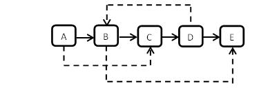
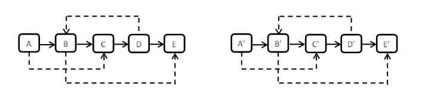

时间限制：1秒 空间限制：32768K 热度指数：386483

本题知识点： [链表](https://www.nowcoder.com/questionCenter?questionTypes=000100&mutiTagIds=580)

### 题目描述

输入一个复杂链表（每个节点中有节点值，以及两个指针，一个指向下一个节点，另一个特殊指针指向任意一个节点），返回结果为复制后复杂链表的 head。（注意，输出结果中请不要返回参数中的节点引用，否则判题程序会直接返回空）

**示例1**

**输入：**

**输出：**

### 解题说明

有两种方法，

一种是用 HashMap 保存原链表节点到新链表节点的对应关系，这样就可以找到每个链接对应的节点

另一种方法非常巧妙，先把新节点插入到对应原节点的后边，这样也就可以获取到原节点和新节点的对应关系了，复制随机指针的时候，只要让新节点的随机指针指向原节点随机指针指向的节点的下一个就行了，最后再把链表拆分成两个链表。