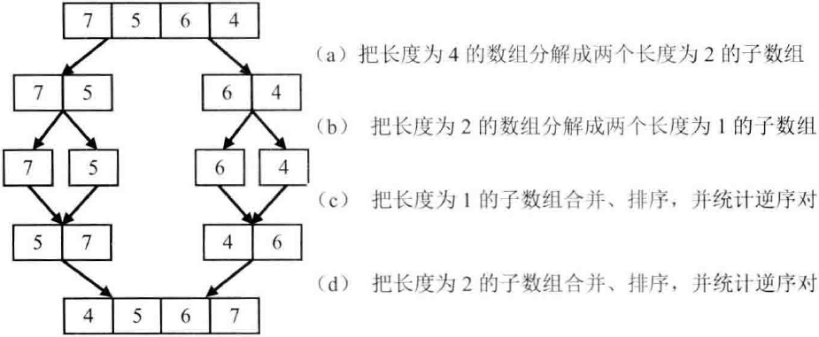

时间限制：2秒 空间限制：32768K 热度指数：352582

本题知识点： [数组](https://www.nowcoder.com/questionCenter?questionTypes=000100&mutiTagIds=578)

## 题目描述

在数组中的两个数字，如果前面一个数字大于后面的数字，则这两个数字组成一个逆序对。输入一个数组,求出这个数组中的逆序对的总数P。并将P对1000000007取模的结果输出。 即输出P%1000000007

## 输入描述:

```
题目保证输入的数组中没有的相同的数字数据范围：	对于%50的数据,size<=10^4	对于%75的数据,size<=10^5	对于%100的数据,size<=2*10^5
```

示例1

## 输入

[复制](javascript:void(0);)

```
1,2,3,4,5,6,7,0
```

## 输出

[复制](javascript:void(0);)

```
7
```

## 解题说明

暴力法会超时，这里需要用分治思想，代码类似归并排序。  
把数组分成两段，分别统计每段内的逆序对。  
然后进行合并，合并的时候再统计新产生的逆序对。  
两者相加就是整段中的逆序对。

